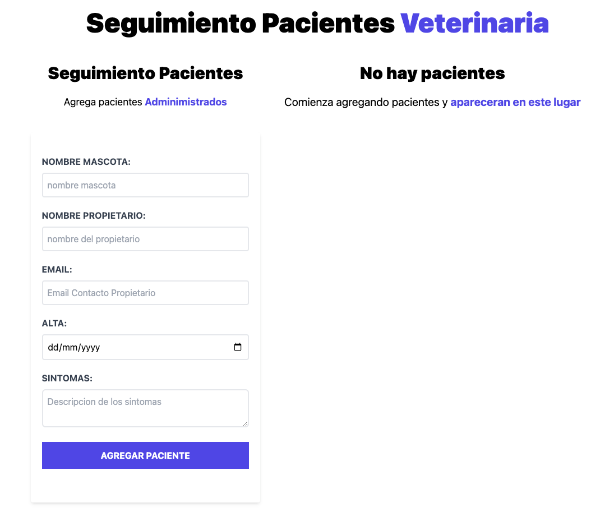

Description

basic project of react - javascript where it consists of the follow-up of veterinary patients where the concepts of:

- CRUD
- ready design pattern
- Using the localStorage API
-Hook(useState, useEffect, useCallback)
-Custom hooks
-Pure component
- Use of memo
- Render props
- Form controlled
- Use of css framework

Build with

- vite
-Taildwindcss
-React
-Javascript

getting started

npm install
npm run dev

demo: https://medicalappointments01.netlify.app/

